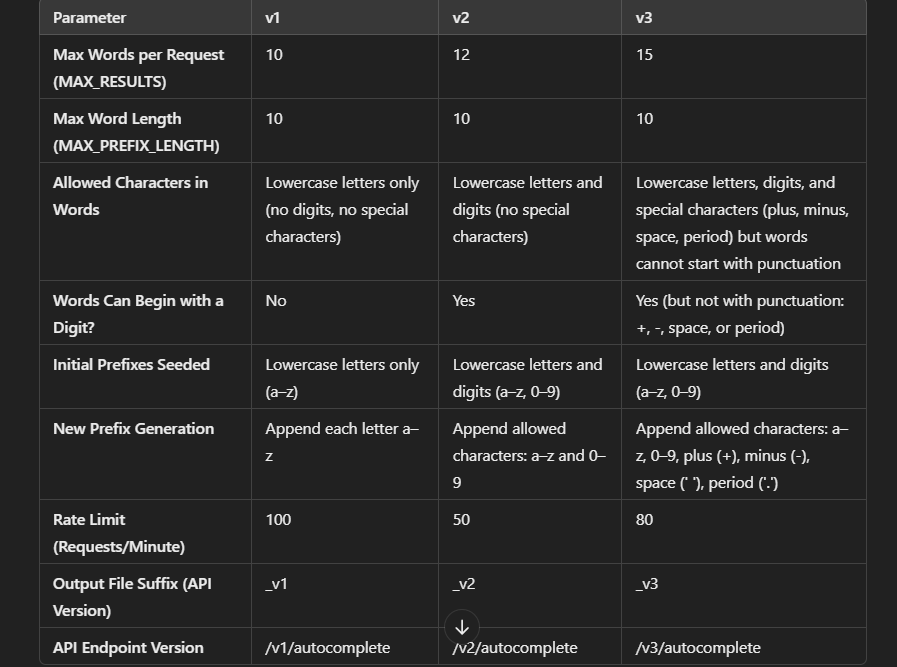

# Ivy_homes_challenge
 The core logic remains similar across v1, v2, and v3—with the overall process (token bucket rate limiting, dynamic prefix exploration, and deduplication of results) remaining constant—but the parameter values and allowed character sets are adjusted based on the API’s behavior in each version. Here’s a summary in tabular format:

 

 

Code can be understood from the comments.

Tools used for analysis:

1)Postman
2)Python

Approach:

1)I experimented with the v1, v2, and v3 endpoints of the API using different query parameters ranging from an empty string to characters, special symbols, and digits.

Outcome:I discovered the maximum words per request, maximum word length, and allowed characters.

2)I used Postman to analyze the API constraints. I created a prefixes.csv file using Python to test the v1, v2, and v3 endpoints by utilizing collection runner.

Pre-request and post-response scripts are added as text files.

Outcome:In requests that returned a 429 status code, I did not find any "Retry-After" header; however, I obtained detail information in the response section from which I fetched the rate limit.
The average response time was between 40-60 ms for each endpoint.

3)I used Python to test the script, optimize the code, and ensure it works within the API constraints.

The code incorporates several key optimizations to efficiently query the API while staying within its constraints. Here’s a breakdown in bullet points:

-Rate Limiting with Token Bucket:
The token bucket algorithm enforces the API's rate limits (e.g., 50, 80, or 100 requests per minute) by allowing only a fixed number of tokens (requests) in a given period. When tokens are exhausted, the thread waits until new tokens are available.

-Exponential Backoff for 429 Responses:
When the API returns a 429 status code (too many requests), the code increases the delay (exponentially) between retries. This ensures the system backs off gracefully without overwhelming the server.

-Multi-threaded Query Processing:
Worker threads run concurrently, fetching data in parallel. This speeds up the extraction process while ensuring that overall request rates stay within limits due to the token bucket control.

-Dynamic Prefix Exploration with Deduplication:
The code uses sets to track both the prefixes that have already been queried and the unique names returned. This avoids redundant queries and ensures that only new prefixes are added for further exploration.

-Efficient Prefix Seeding and Generation:
Initial prefixes are seeded based on allowed characters (which differ by API version). New prefixes are generated by appending allowed characters to existing prefixes, ensuring that only valid queries are sent to the API.

-Periodic Progress Saving:
The code automatically saves the extracted names and request statistics every 100 API requests. This not only provides a checkpoint for recovery in case of interruption but also helps monitor progress.

Intersting tradeoff:
Expanding prefixes regardless of whether new names are found ensures the autocomplete space is fully explored, even if it means making some extra API calls that yield duplicates. However, limiting expansion only to prefixes that return new names reduces calls but may stop the search too early and miss unique names deeper down.
I went for completness.

I didn't fetch all the results from the API; I stopped the process midway.